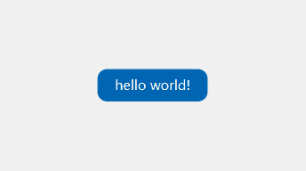
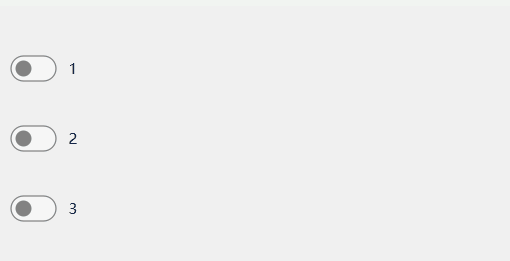

# Qt TinyWidgetLibrary Design Widgets

<table>
  <tbody>
    <tr>
      <td colspan="2" align="center"></td>
    </tr>
    <tr>
      <td>
        App Bar
      </td>
      <td>
        <code>CheckButton</code>
      </td>
    </tr>
    <tr>
      <td colspan="2" align="center">
        
      </td>
    </tr>
    <tr>
      <td>
        Auto Complete
      </td>
      <td>
        <code>RadioButton</code>
      </td>
    </tr>
    <tr>
      <td colspan="2" align="center">
        
      </td>
    </tr>
    <tr>
      <td>
        Avatar
      </td>
      <td>
        <code>MessageBoxHint</code>
      </td>
    </tr>
    <tr>
      <td colspan="2" align="center">
        
      </td>
    </tr>
    <tr>
      <td>
        Badge
      </td>
      <td>
        <code>SizeFixedDialog</code>
      </td>
    </tr>
    <tr>
      <td colspan="2" align="center">
        
      </td>
    </tr>
    <tr>
      <td>
        Check Box
      </td>
      <td>
        <code>Slider</code>
      </td>
    </tr>
    <tr>
      <td colspan="2" align="center">
        
      </td>
    </tr>
    <tr>
      <td>
        Circular Progress
      </td>
      <td>
        <code>StandardButton</code>
      </td>
    </tr>
    <tr>
      <td colspan="2" align="center">
        
      </td>
    </tr>
    <tr>
      <td>
        Dialog
      </td>
      <td>
        <code>SwitchButton</code>
      </td>
    </tr>
    <tr>
      <td colspan="2" align="center">
        
      </td>
    </tr>
    <tr>
      <td>
        Drawer
      </td>
      <td>
        <code>ToggleButton</code>
      </td>
    </tr>
    <tr>
      <td colspan="2">
        
      </td>
    </tr>
  </tbody>
</table>